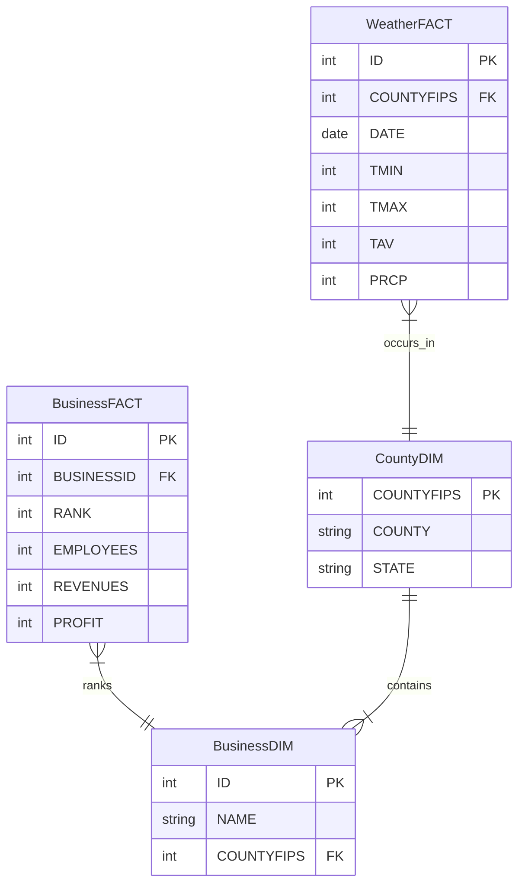
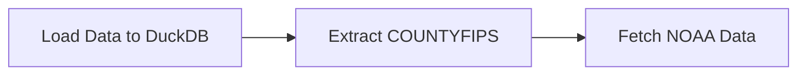
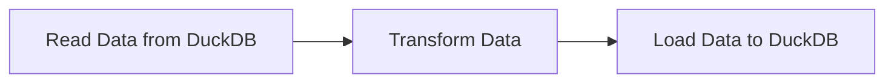
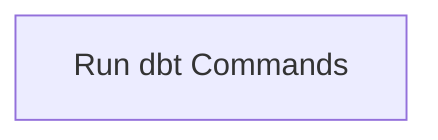
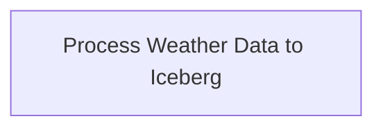
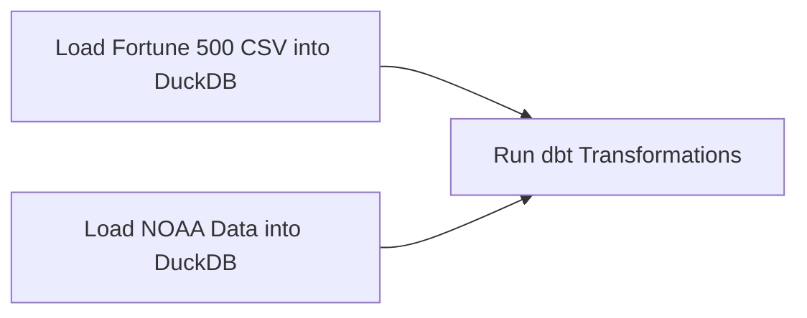
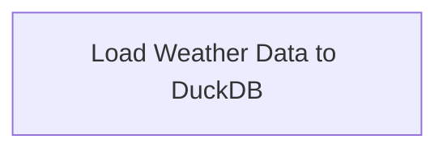
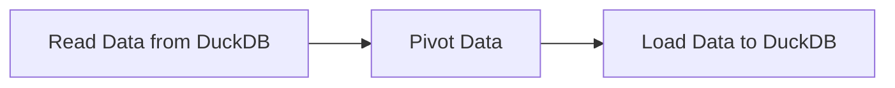

# DELTA/TERMINAL

## Tool for analysing business data with environmental factors

## Project created in context of the course Data Engineering in winter term 2024 at University of Tartu

### General:
We created an multi-container application. Our Application consists of four modules:
1) Data Extraction
2) Data Analysis Service
3) Database for Users
4) UI Service

> Create the application with `docker compose up -d`

> [!WARNING]  
> After all containers started, you must `docker compose stop analytics`  
> to run DAGs in Airflow Service. After all DAGs successfully ran,  
>`docker compose stop airflow` and `docker compose up analytics`

>[!NOTE]  
> Open `https://localhost/` for the UI. 

---
# Data Model

---

# ETL PROCESS
To see which DAGs trigger the ETL process, see **Walkthrough of the ETL** subsection ***Transformations as DAGs***

## The Datasets

This ETL process combines two datasets:
- Business data - The Forbes 500 Corporate Headquarters dataset from Kaggle, and
- Weather data - Weather observations from NOAA.
These datasets will be linked together by the **counties** in which the headquarters are located.

## Walkthrough of the ETL
### High-level walkthrough

### DAG 1: `kaggle_to_noaa`

### DAG 2: `fortune_500_data_processing`

### DAG 3: `dbt_execution_dag1`

### DAG 4: `load_weather_json_to_iceberg`

### DAG 5: `load_and_transform_data`

### DAG 6: `process_weather_data`

### DAG 7: `weather_data_processing`

The ETL can be broken down into two basic steps:
1) ETL the business data,
2) ETL the weather data.

To ETL the Business data, we
1) download the data from Kaggle,
2) load it into DuckDB,
3) transform the data using Pandas.
During this process, we also extract the **county identifiers** from the raw business dataset that we will use to extract the weather data and, later, join the two datasets in our analytical queries.

To ETL the Weather data, we
1) send requests to the NOAA API using the county identifiers we got from the Business ETL process,
2) save the results as json files, we have to do this piecemeal, one county at a time, since the API has rate limits.
    - this results in as many json files as there are counties.
3) These json files are then combined into a single weather table and loaded into the DuckDB database.
4) This data is then transformed using Pandas.

### Transformations in detail
The Business transformations consist mostly of breaking the source dataset down into three tables to fit the star schema:

1) BusinessFACT which contains
    * the company identifier (business id),
    * measurables like revenue, profits and number of employees for a given company
2) BusinessDIM which contains
    * id and name, and
    * the county id (the county in which the head is quartered)
3) CountyDIM which contains
    * county id and name, and
    * state to which the county belongs (e.g Wichita county belongs to Texas state.)

The Weather transformations result in a single table:
1) WeatherFACT which contains
    * date,
    * county id,
    * and the weather observations for
    - minimum temperature,
    - maximum temperature,
    - average temperature,
    - amount of precipitation.

Each row in the WeatherFACT table now describes the weather of a single day in a single county with these four measurements.

### Transformations as DAGs
 1) **kaggle_to_noaa**
 2) **fortune_500_data_processing**/**dbt_execution_dag1**\*
 2) **process_weather_data**
 3) **weather_data_processing**
  You can run *fortune_500_data_processing* and *process_weather_data* in which-ever order, the rest have to be ordered as listed.
 \* fortune_500_data_processing and dbt_execution_dag1 perform the same transformations on the business data. The difference is that dbt_execution_dag1 uses dbt instead of pandas - the changes can be recorded for Data Governance with dbt.

What follows is a more thorough documentation of the ETL process:

In /etl/repo/airflow/dags we have 4 important python files:
* business_etl_v1.py
* business_transform.py
* weather_to_duckdb.py
* weather_transform.py
* dbt_dag.py

**business_etl_v1.py**
 An important part is to have something to tie the business and weather data together. The businesses are headquartered in counties and we can aggregate the weather observations to county level averages.
 We extract the county identifiers from the business dataset and use these to fetch only the weather observations that are relevant to our business data.
 **DAG name: 'kaggle_to_noaa'**
1) pulls the business dataset from Kaggle,
2) extracts the county fips codes (used to pull corresponding weather data later),
3) loads the raw business data into the database, and
4) fetches the weather data from NOAA, does a simple aggregation to county level averages, and 
5) saves it in json format, a json file for each county

**business_transform.py**
 We want the data in star schema, thus we break down the dataset into facts and dimensions.
 **DAG name: 'fortune_500_data_processing'**
1) reads business data from DuckDB,
2) transforms the business data as described previously in "Transformations in detail" under Business transformations,
3) loads the data back into DuckDB database.

**weather_to_duckdb.py**
 We pulled the weather data as separate json files for each county.
Now we want to combine them into a single table and load that into a database.
 **DAG name: 'process_weather_data'**
1) locates the weather jsons in the data folder,
2) reads and combines these into a single dataframe,
3) loads that into the DuckDB databse.

**weather_transform.py**
 The big weather table we loaded into DuckDB has four columns: *date, county, datatype, value*
 Datatype has four possible values: *TMIN, TAVG, TMAX and PRCP.*
 These are weather observations like minimum temperature or amount of precipitation.
 For ease of use, we want to have a column for each observation. To accomplish this, we need to pivot the table.
 **DAG name: 'weather_data_processing'**
1) reads the big weather table from DuckDB,
2) pivots the table,
3) loads the pivoted table back into the database.

 **business_etl_v1.py**
 Transforms business data into Business Dimension and Fact tables using dbt.
 **DAG name: dbt_execution_dag1**

## The datasets in more detail
*See DICTIONARY.MD for comprehensive explanation of datasets after transformations*
We are working with two data sources
1) The Corporate Headquarters dataset (or the business data)
2) Weather observations for the counties of these headquarters

### The Corporate Headquarters' data
Contains the Fortune 500 companies of 2017.
It's a dataset from Kaggle from the user ARMAN.
[Link to dataset](https://www.kaggle.com/datasets/mannmann2/fortune-500-corporate-headquarters)

The list only contains US companies and for these we have measurements like the company's rank in the list, their revenues and profits and number of employees - all for the year 2016 which precedes the year of the ranking.

### Weather data from NOAA
NOAA is the US National Oceanic and Atmospheric Administration. The data is pulled using NOAA's API from the ghcnd dataset which is *global historical daily weather dataset*.
 
The data query is filtered using the county fips codes (unique identifiers for US counties) which we get from the corporate headquarters dataset. That way we don't pull any irrelevant data.
 
Also, we only pull data for the year 2016 - which is the year on which the Fortune 500 2017 list was compiled.

The data is stored first in json files - each json file contains weather observations for a single county. The contents of said json files are aggregated. The reason being, a single county will have multiple weather stations - we want to take an average over these different stations so that we have a single average measurement for each day.

# Data Governance

The dbt-generated data governance files are located in /etl/my_dbt_project/target/
## Data Dictionary
dbt-generated dictionary in catalog.json.
 A manually composed data dictionary is provided in a separate file **DICTIONARY.MD** and contains definitions of the tables in our data models, definitions for their respective field with explanations of the meanings behind the data.

## Data Lineage
dbt-generated data lineage in manifest.json

---
# Serving the Data

The application consists of a **Flask API** and a **Streamlit frontend**. The Flask API handles data retrieval and processing, while the Streamlit app provides an interactive user interface for exploring the data.

## Our API 
Start the API Service. When you enter the root domain of this service, you will see a documentation how to use the API. 

## Streamlit Frontend
A user have to login into the frontend with his Google Account. Our System track user activities. People with admin role can see the activities. 

>[!NOTE]
> A detailed `README.md` according to our frontend in directory `UI`

