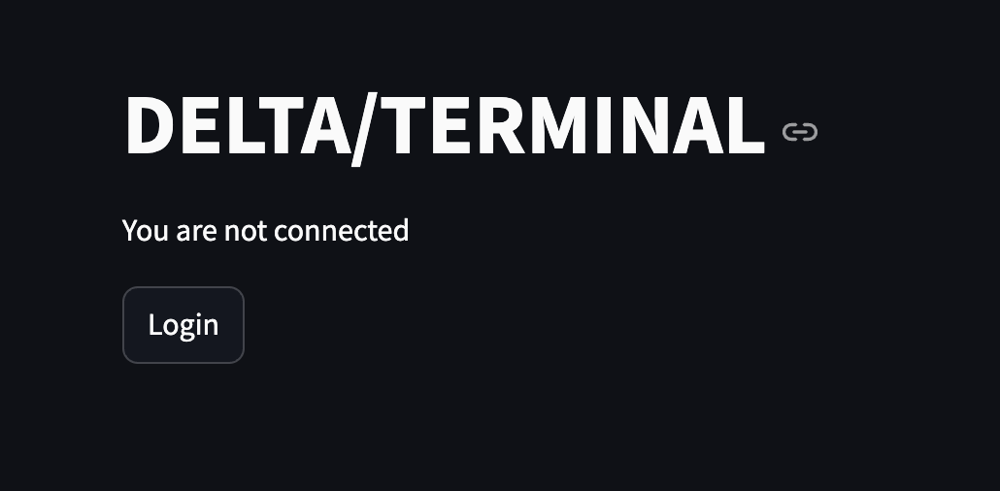
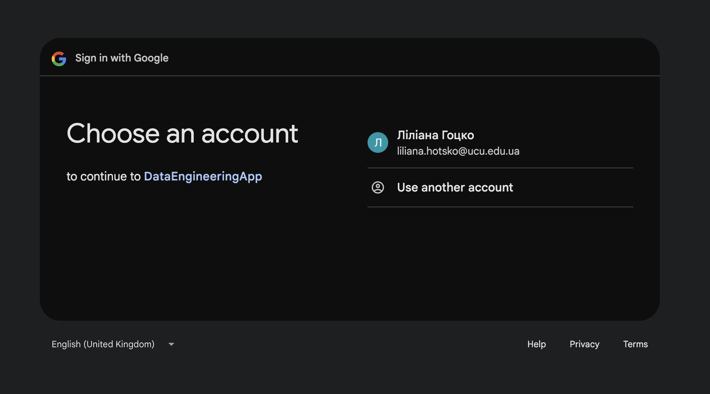
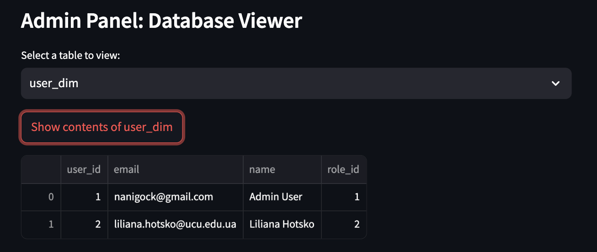
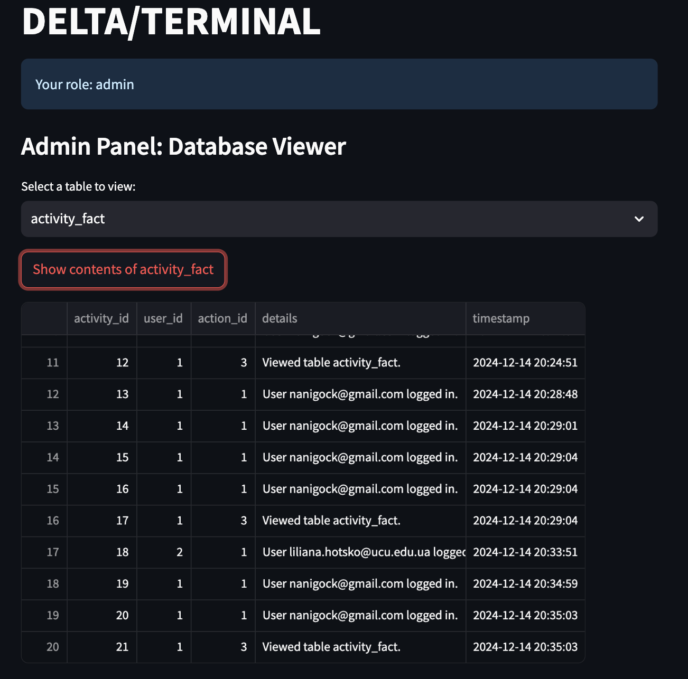
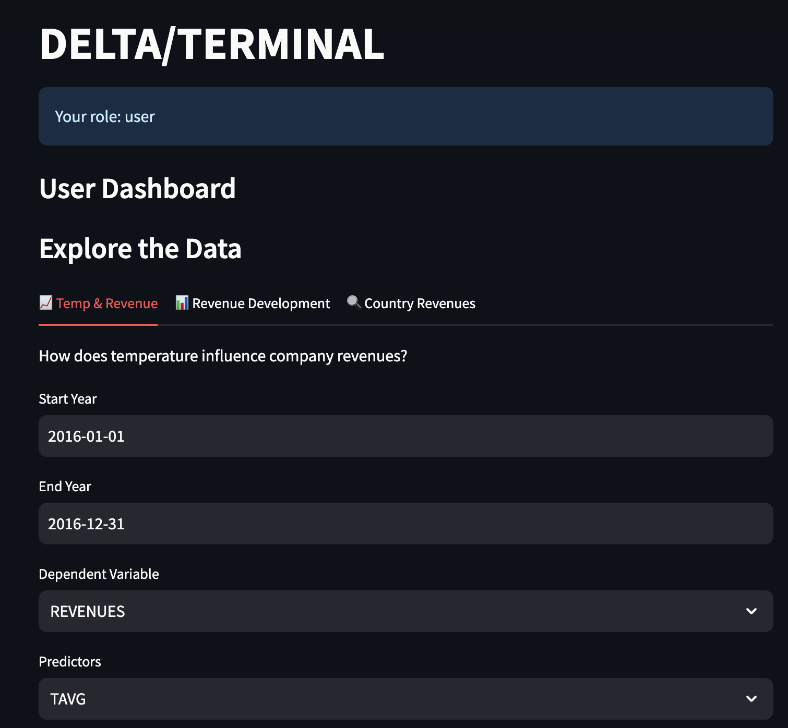

# Delta/Terminal Dashboard

## Overview

The **Delta/Terminal Dashboard** is a user-friendly web application built with **Streamlit** that provides an interactive interface for managing and analyzing data. It integrates with a PostgreSQL database and external APIs to deliver actionable insights and seamless data visualization. The app supports role-based access control, allowing administrators and users to perform distinct tasks.

## Features

### 🔒 **Safety**

- **Enabeled HTTPS mode using NGINX**

- created certificate using `openssl`

### 🔒 **Authentication**
- **Google OAuth Integration**: Secure user authentication with Google accounts.
- Session-based user roles: Admin and Regular User.

### 🛠 **Admin Panel**
- View and manage database tables:
  - `role_dim`
  - `user_dim`
  - `action_dim`
  - `activity_fact`
- Inspect and interact with table data directly.

### 📊 **User Dashboard**
- Explore and visualize data trends interactively.
- Generate dynamic charts and visualizations.

### 📈 **Data Insights**
#### Tab 1: Temperature and Revenue
- Analyze how temperature influences company revenues.
- Customize views with:
  - Time ranges (start and end dates)
  - Dependent variables (e.g., `REVENUES`, `profit`, `sales`)
  - Predictors (e.g., `TAVG`)
  - Instruments (e.g., list of companies)

#### Tab 2: Revenue Development Over Time
- Track the development of company revenues over a specified period.
- Select companies and visualize data trends.

#### Tab 3: Country Revenue Analysis
- Aggregate revenues by country.
- Analyze and visualize geographical revenue distributions.

### 📜 **Logging**
- Tracks all user actions in the `activity_fact` table, including:
  - Login/logout events
  - Chart generation
  - Table views
- Supports activity auditing for admin users.

---
