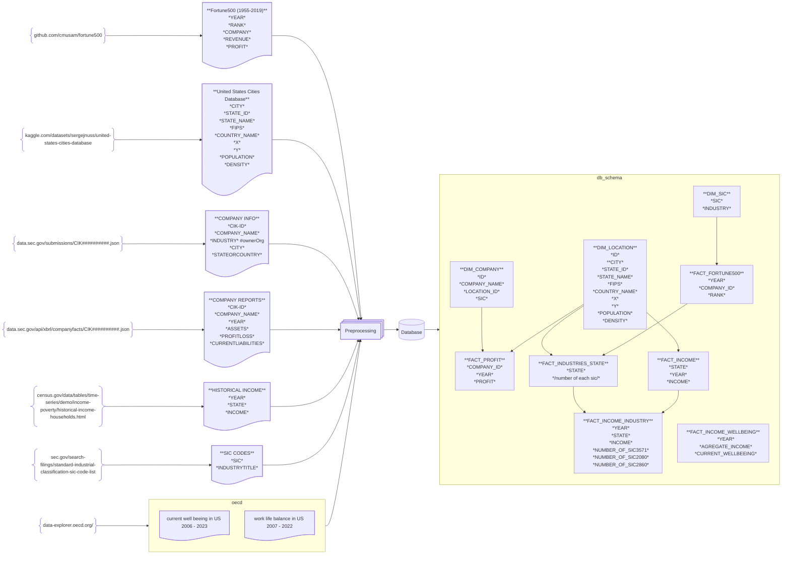

```mermaid
flowchart LR

fortune500_55_19["**Fortune500 (1955-2019)**
*YEAR*
*RANK*
*COMPANY*
*REVENUE*
*PROFIT*
"]@{shape: doc}
s_f500_55_19@{ shape: braces, label: "github.com/cmusam/fortune500" }
s_f500_55_19 --> fortune500_55_19

cities[**United States Cities Database**
*CITY*
*STATE_ID*
*STATE_NAME*
*FIPS*
*COUNTRY_NAME*
*X*
*Y*
*POPULATION*
*DENSITY*
]@{shape: doc}
C@{ shape: braces, label: "kaggle.com/datasets/sergejnuss/united-states-cities-database"}
C --> cities

companyInfo[
    **COMPANY INFO**
    *CIK-ID* 
    *COMPANY_NAME*
    *INDUSTRY* #ownerOrg
    *CITY*
    *STATEORCOUNTRY*
]@{shape: doc}
D@{ shape: braces, label: "data.sec.gov/submissions/CIK##########.json"}
D--> companyInfo

companyReports[
    **COMPANY REPORTS**
    *CIK-ID* 
    *COMPANY_NAME*
    *YEAR*
    *ASSETS*
    *PROFITLOSS*
    *CURRENTLIABILITIES*
]@{shape: doc}
E@{ shape: braces, label: data.sec.gov/api/xbrl/companyfacts/CIK##########.json}
E--> companyReports

subgraph oecd
    a[current well beeing in US 2006 - 2023]@{shape: doc}
    b[work life balance in US 2007 - 2022]@{shape: doc}
end
F@{ shape: braces, label: data-explorer.oecd.org/}
F--> oecd

income[
    **HISTORICAL INCOME**
    *YEAR*
    *STATE*
    *INCOME*
]@{shape: doc}
G@{ shape: braces, label: census.gov/data/tables/time-series/demo/income-poverty/historical-income-households.html}
G--> income

sic[
    **SIC CODES**
    *SIC*
    *INDUSTRYTITLE*
]@{shape: doc}
H@{ shape: braces, label: sec.gov/search-filings/standard-industrial-classification-sic-code-list}
H--> sic

Preprocessing@{ shape: processes}
fortune500_55_19 --> Preprocessing
cities --> Preprocessing
companyInfo --> Preprocessing
companyReports --> Preprocessing
oecd --> Preprocessing
income --> Preprocessing
sic --> Preprocessing

dim_company[
    **DIM_COMPANY**
    *ID*
    *COMPANY_NAME*
    *LOCATION_ID*
    *SIC*
]

dim_location[
    **DIM_LOCATION**
    *ID*
    **CITY*
    *STATE_ID*
    *STATE_NAME*
    *FIPS*
    *COUNTRY_NAME*
    *X*
    *Y*
    *POPULATION*
    *DENSITY*
]

dim_sic[
    **DIM_SIC**
    *SIC*
    *INDUSTRY*
]

fact_profit[
    **FACT_PROFIT**
    *COMPANY_ID*
    *YEAR*
    *PROFIT*
]

fact_income[
    **FACT_INCOME**
    *STATE*
    *YEAR*
    *INCOME*
]

fact_industry_state[
    **FACT_INDUSTRIES_STATE**
    *STATE*
    */number of each sic/*
]

fact_fortune500[
    **FACT_FORTUNE500**
    *YEAR*
    *COMPANY_ID*
    *RANK*
]

fact_income_industry[
    **FACT_INCOME_INDUSTRY**
    *YEAR*
    *STATE*
    *INCOME*
    *NUMBER_OF_SIC3571*
    *NUMBER_OF_SIC2080*
    *NUMBER_OF_SIC2860*
]

fact_income_wellbeing[
    **FACT_INCOME_WELLBEING**
    *YEAR*
    *AGREGATE_INCOME*
    *CURRENT_WELLBEEING*

]

subgraph db_schema
    dim_sic --> fact_fortune500
    dim_company --> fact_profit
    dim_location --> fact_profit
    dim_location --> fact_income
    dim_location --> fact_industry_state
    fact_fortune500 --> fact_industry_state
    fact_industry_state --> fact_income_industry
    fact_income --> fact_income_industry
    fact_income_wellbeing
end

Preprocessing --> db[(Database)] --> db_schema
```
